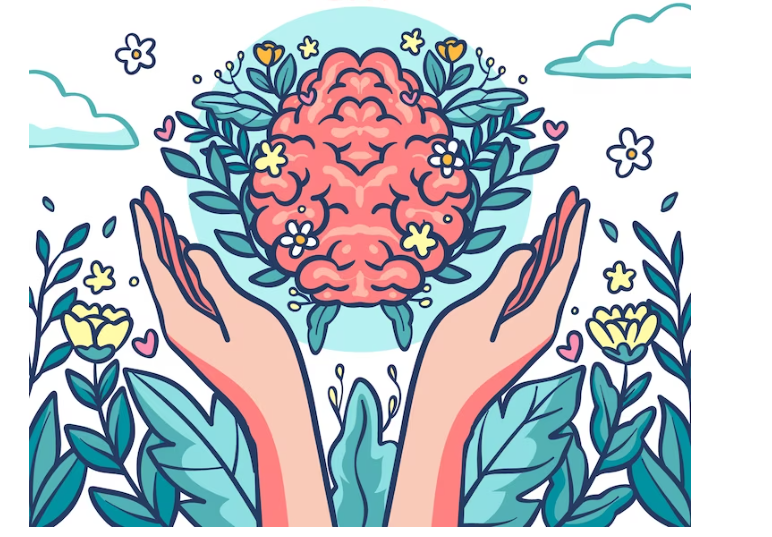

# UMatter

<div align = "left">
 
 <div>

**Check the Website [here](https://umatter-git-main-monalikapatnaik.vercel.app/)**.

Welcome to UMatter, an inclusive platform designed to help individuals quit bad habits by providing personalized sessions and one-on-one consultations with professionals.

UMatter is an one and all platform to help people quitting bad habits by providing them personalized sessions and one to one consultations with professionals.

<div align="left">


   <br>
   
   
   
    

   
    
    

   
   
  
 
     </div>  
  
<br>
<br>

**Tech Stack Used**

<div align="left">
 
 
 
 
 
</div>

# Website Overview

UMatter is committed to supporting individuals on their journey to overcome bad habits. Our website offers a range of services and resources to help users make positive changes in their lives. With a user-friendly interface and a team of dedicated professionals, UMatter is here to guide and empower you every step of the way.

# Key Features ✨

- Landing Page: When you visit our website, you'll be greeted by an engaging landing page that captures the essence of UMatter. Get inspired to take the first step towards a healthier and happier life.

- About Us: Learn more about UMatter and our mission. Discover how our platform can provide you with the necessary tools and support to break free from bad habits.

- Services Page: This page provides you with the list of serives that are provided by UMatter such as consulting a doctor, attending a working and connecting with friends.

- Blogs Page: Provides you with useful blog posts on different matters and areas of concern in our life.

## **Components of Website**

**Landing Page**

The landing page is the initial point of entry for users when they click on our site. It serves as the first glimpse of what we have to offer and provides a seamless transition from the user's click to their arrival on the page.


<br>
  
**About Us**
 
 Discover a comprehensive solution for quitting smoking and drinking at UMatter. Our platform provides personalized consultations and medications, bringing you closer to a healthier life. With dedicated experts, we offer tailored support, empowering you to overcome challenges and achieve your health goals. Join us on this transformative journey today.
 

<br>

**Services Page**

Welcome to our Services page! Here, you will find a comprehensive list of the wide range of services available on our website. From tailored consultations to specialized treatments, we offer an array of options to cater to your specific needs. Explore our services to discover how we can assist you in achieving your goals and enhancing your experience on our platform.


<br>
  
**Blogs Page**

Welcome to our Blog section! Here, you'll find a collection of informative and engaging articles covering a variety of useful topics. Our blog pages are packed with valuable insights, tips, and resources to help you stay informed and inspired. Explore our diverse range of blog posts to expand your knowledge and find practical solutions to enhance your lifestyle.


<br>
  
## 🔖Steps to Contribute ✅
 
- Contribution is the best way to support and get involved in community!
 - Contributions to `UMatter` Please check our [CONTRIBUTING.md](./CONTRIBUTING.md)

## If you have any idea or question 🤷

- [Raise an issue](https://github.com/MonalikaPatnaik/UMatter/issues)
- [Feature request](https://github.com/MonalikaPatnaik/UMatter/issues)
- [Code submission](https://github.com/MonalikaPatnaik/UMatter/pulls)

### ✨🔨Note:

> - Do not edit/delete someone else's script in this repository. You can only insert new files/folders into this repository.

> - Give a meaningful name to whatever file or folder you are adding, changing etc.

## 🔑Guidelines✨

1. Welcome to this repository, if you are here as an open-source program participant/contributor.
2. Participants/contributors have to **comment** on issues they would like to work on, and mentors or the PA will assign you.
3. Issues will be assigned on a **first-come, first-serve basis.**
4. Participants/contributors can also **open their issues** using issue_template,
   but it needs to be verified and labelled by a mentor or PA. Please discuss with the team once before opening your issues. We respect all your contributions, whether
   it is an Issue or a Pull Request.
5. When you raise an issue, make sure you get it assigned to you before you start working on that project.
6. Each participant/contributor will be **assigned 1 issue (max)** at a time to work.
7. Participants are expected to follow **project guidelines** and **coding style** . **Structured code** is one of our top priorities.
8. Try to **explain your approach** to solve any issue in the comments. This will increase the chances of you being assigned.
9. Don't create issues that are **already listed**.
10. Please don't pick up an issue already assigned to someone else. Work on the issues after it gets **assigned to you**.
11. Make sure you **discuss issues** before working on the issue.
12. Pull requests will be merged after being **reviewed** by a mentor or PA.
13. It might take **a day or two** to review your pull request. Please have patience and be nice.
14. Always create a pull request from a **branch** other than `main`.
15. Participants/contributors have to complete issues before the decided Deadline. If you fail to make a PR within the deadline, then the issue will be assigned to
    another person in the queue.
16. While making PRs, don't forget to **add a description** of your work.
17. Include issue number (Fixes: issue number) in your commit message while creating a pull request.
18. Make sure your solution to any issue is better in terms of performance and other parameters in comparison to the previous work.
19. We all are here to learn. You are allowed to make mistakes. That's how you learn, right!.

<!-- ----------------------------------------- -->

## A special section of guidelines and measures to be taken for some specific issues users may encounter while running this project:

1. 'react-scripts' is not recognized as an internal or external command,
   operable program or batch file.

-> The error message suggests that the command 'react-scripts' is not recognized as an internal or external command on your system. This error commonly occurs when the required dependencies are not installed or not available in the system's PATH environment variable.

To resolve this issue, you can follow these steps:

a] Make sure you have installed the required **dependencies** by running the following command in the project directory:
<**npm install**>.
This command will install the necessary packages specified in the '**package.json**' file.

b] If the dependencies are already installed and you still encounter the error, it's possible that the **'react-scripts' package** is not **installed globally** on your system. You can try installing 'react-scripts' globally by running the following command:
<**npm install -g react-scripts**>

c] If the above steps don't resolve the issue, you can try **deleting the 'node_modules'** directory and **reinstalling the dependencies**. Run the following commands:
<**rm -rf node_modules**> & <**npm install**>

2. npm WARN deprecated stable@0.1.8: Modern JS already guarantees Array#sort() is a stable sort, so this library is deprecated. See the compatibility table on MDN: https://developer.mozilla.org/en-US/docs/Web/JavaScript/Reference/Global_Objects/Array/sort#browser_compatibility>

npm WARN deprecated rollup-plugin-terser@7.0.2: This package has been deprecated and is no longer maintained. Please use @rollup/plugin-terser

npm WARN deprecated sourcemap-codec@1.4.8: Please use @jridgewell/sourcemap-codec instead

npm WARN deprecated w3c-hr-time@1.0.2: Use your platform's native performance.now() and performance.timeOrigin.

npm WARN deprecated workbox-cacheable-response@6.6.0: workbox-background-sync@6.6.0

npm WARN deprecated svgo@1.3.2: This SVGO version is no longer supported. Upgrade to v2.x.x.

-> These warnings indicate that certain packages used in your project are no longer **maintained** or have been replaced by newer versions or alternatives. The warnings themselves do not necessarily indicate any critical issues, but they suggest that you might want to consider **updating or replacing the mentioned packages** in order to ensure the long-term stability and compatibility of your project.

3. Proxy error: Could not proxy request /manifest.json from localhost:3000 to http://localhost:8081/.
   See https://nodejs.org/api/errors.html#errors_common_system_errors for more information (ECONNREFUSED).

-> The error message provided suggests that there is a **proxy error** while attempting to proxy a request from **localhost:3000 to http://localhost:8081/**. The error message also mentions the **ECONNREFUSED error code**, which typically indicates that the connection to the **target server (localhost:8081 in this case)** was refused or not available.

To overcome this issue, a few measures can be taken:

a] **Proxy configuration**: If you are using a proxy server to redirect requests, ensure that the proxy server is properly configured and able to forward the request to localhost:8081.

b] **Port conflict**: It's possible that another application or process is already using port 8081, causing a conflict. Try using a different port for the target server, or check for any other applications using the same port and terminate them if necessary.

4. Failed to fetch
   TypeError: Failed to fetch
   at http://localhost:3000/static/js/bundle.js:7115:5
   at commitHookEffectListMount (http://localhost:3000/static/js/bundle.js:40975:30)
   at commitPassiveMountOnFiber (http://localhost:3000/static/js/bundle.js:42468:17)
   at commitPassiveMountEffects_complete (http://localhost:3000/static/js/bundle.js:42440:13)
   at commitPassiveMountEffects_begin (http://localhost:3000/static/js/bundle.js:42430:11)
   at commitPassiveMountEffects (http://localhost:3000/static/js/bundle.js:42420:7)
   at flushPassiveEffectsImpl (http://localhost:3000/static/js/bundle.js:44305:7)
   at flushPassiveEffects (http://localhost:3000/static/js/bundle.js:44257:18)
   at http://localhost:3000/static/js/bundle.js:44072:13
   at workLoop (http://localhost:3000/static/js/bundle.js:189770:38)

-> The error shown above indicates a **"Failed to fetch"** error, along with a **stack trace** pointing to specific lines in **bundle.js** file. This error typically occurs when there is a problem with making a **network request**, such as an **API call**, and fetching the required data.

Here are a few steps you can take to troubleshoot and resolve the issue:

a] **Check the API endpoint**: If you are making an API call, verify that the API endpoint is correct and accessible. You can test the endpoint using tools like cURL or Postman to see if you receive a response.

b] **CORS (Cross-Origin Resource Sharing)**: If you are making requests to a different domain or port, ensure that the server is configured to allow cross-origin requests from your application. The server should include the appropriate CORS headers in its responses.

<!-- ----------------------------------------- -->

## 😎 Project Maintainers

<table>
  <tr>
<td align="center">
<br /><sub><b><a href="https://github.com/MonalikaPatnaik">Monalika Patnaik</a></b></sub></td>

<td align="center">
<br /><sub><b><a href="https://github.com/i-am-SnehaChauhan">Sneha Chauhan</a></b></sub></td>
 
<td align="center">
<br /><sub><b><a href="https://github.com/Mansi168">Mansi</a></b></sub></td>
   
 </tr>
</table>

## 💯 Mentors

<table>
  <tr>

```
Mentors here 🚧
```

<!-- Just Insert here the mentors  👇-->

<!-- <td align="center">
<br /><sub><b><a href="https://github.com/MonalikaPatnaik">Monalika Patnaik</a></b></sub></td> -->

<!-- <td align="center">
<br /><sub><b><a href="https://github.com/i-am-SnehaChauhan">Sneha Chauhan</a></b></sub></td> -->

<!-- <td align="center">
<br /><sub><b><a href="https://github.com/muditchoudhary">Mansi</a></b></sub></td> -->

 </tr>
</table>

## License 🪪

[MIT license](https://opensource.org/license/mit/)

## Thanks to all the Contributors ❤️

<a href = "https://github.com/MonalikaPatnaik/UMatter/graphs/contributors">

  

</a>
